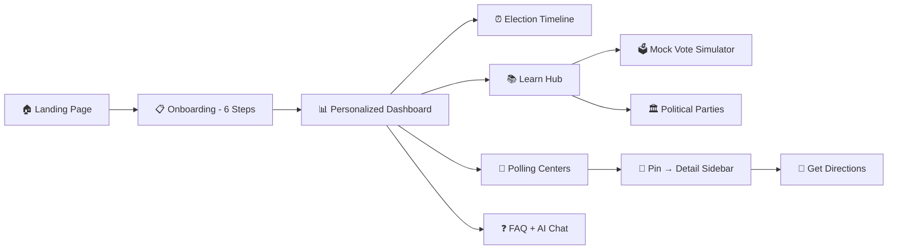

<h1 align="center">
  🗳️ VoteGuide AI
</h1>

<p align="center">
  <strong>An AI-powered interactive election assistant that demystifies India's voting process for first-time and returning voters.</strong>
</p>

<p align="center">
  
  
  
  
  
</p>

---

## 📌 Chosen Vertical

> **Election Process Assistant** — Help users understand the election process, timelines, and steps in an interactive and easy-to-follow way.

## 🎯 Problem Statement
**"Create an assistant that helps users understand the election process, timelines, and steps in an interactive and easy-to-follow way."**

VoteGuide AI perfectly aligns with this by providing a conversational, multi-lingual interface that breaks down complex voting requirements into simple, interactive, and easy-to-follow steps.

---

## 🎯 Approach & Logic

### The Core Problem

> _"I turned 18 last year. I want to vote but I don't know if I'm registered, what documents I need, or where to go."_

This is the reality for **millions of young Indian voters**. The information exists across dozens of government websites, in legal jargon, often only in English or Hindi. We set out to collapse this into a **single, conversational, multilingual experience**.

### Our Approach

We designed VoteGuide AI around **three pillars**:

```
┌─────────────────────────────────────────────────────┐
│                  VoteGuide AI                       │
├──────────────┬──────────────┬───────────────────────┤
│  PERSONALIZE │   EDUCATE    │       LOCATE          │
│              │              │                       │
│  Smart       │  Interactive │  GPS-powered          │
│  Onboarding  │  Learning &  │  Polling Station      │
│  + AI Chat   │  Mock Vote   │  Finder with          │
│  Assistant   │  Simulator   │  Live Distance        │
└──────────────┴──────────────┴───────────────────────┘
```

| Pillar | What It Does | Google Tech Used |
|--------|-------------|-----------------|
| **Personalize** | 6-step onboarding captures user profile → generates a custom dashboard with checklist, deadlines, and next-action items | **Gemini AI** for contextual chat |
| **Educate** | Horizontally-flowing learning cards, a 5-step Mock Voting Booth simulator (EVM + VVPAT), and an interactive Political Party Hemicycle | — |
| **Locate** | Interactive dark-themed map with 8 pre-indexed centers across major Indian cities, GPS geolocation, and a slide-in detail panel with real-time Haversine distance | **Google Maps Embed API** |

### Key Design Decisions

1. **Mobile-first, Landscape-optimized** — Built with `calc(100vh - 4rem)` flex layouts so every page fits the screen without scrolling on desktop
2. **Indian Tricolor Theme** — Saffron (#FF9933) and Green (#138808) as primary/secondary, with a dark glassmorphism aesthetic
3. **Real-time Translation** — A custom `<T>` wrapper component calls Google Translate API dynamically, supporting 10 Indian regional languages
4. **No backend database needed** — All user state (profile, checklist progress) is persisted client-side via Zustand + localStorage, making the app instantly deployable and privacy-friendly

---

## 🖥️ Screenshots

<p align="center">
  
</p>
<p align="center"><em>📊 Personalized Dashboard — Progress ring, action items, checklist, and urgent deadline alerts</em></p>

<br />

<p align="center">
  
</p>
<p align="center"><em>🗺️ Interactive Polling Station Finder — Dark-themed Google Map with detail sidebar showing live distance from your GPS location</em></p>

---

## ⚙️ How the Solution Works

### User Journey Flow



### Step-by-Step Walkthrough

| Step | Screen | What Happens |
|------|--------|-------------|
| 1 | **Landing** | User sees the hero with animated gradient orbs and CTA to begin |
| 2 | **Onboarding** | 6 interactive steps: Country → First-time voter? → Age → Registration status → Language → Accessibility needs |
| 3 | **Dashboard** | Profile-specific hero with progress ring, 11-item checklist across 5 categories, deadline alert card, quick-action grid |
| 4 | **Timeline** | Expandable vertical timeline of all election phases (eligibility → registration → documents → polling day → results) |
| 5 | **Learn** | Horizontally-scrolling card carousel + **Mock Vote Simulator** (5-step interactive booth walkthrough) + **Parliament Hemicycle** (5 major parties on a political spectrum arc) |
| 6 | **Centers** | Full-screen Google Map with floating Locate Me / Zoom controls → click any center in the List View → slide-in sidebar with hours, distance (Haversine from GPS), PWD status, and Google Maps directions |
| 7 | **FAQ** | AI-powered chat using Gemini with a floating politician avatar assistant available on every page |

### Technical Architecture

```
app/                          # Next.js App Router
├── page.tsx                  # Landing page (SSR)
├── layout.tsx                # Root layout + TranslationProvider
├── globals.css               # Design tokens + animations
├── onboarding/page.tsx       # 6-step wizard (client)
├── dashboard/page.tsx        # Personalized dashboard (client)
├── timeline/page.tsx         # Election timeline (client)
├── learn/page.tsx            # Learning + Mock Vote + Parties (client)
├── centers/page.tsx          # Map + List + Detail sidebar (client)
├── faq/page.tsx              # FAQ + AI chat (client)
├── api/
│   ├── chat/route.ts         # POST → Gemini AI proxy
│   └── translate/route.ts    # POST → Google Translate proxy
components/
├── TranslationProvider.tsx   # React Context + <T> wrapper
├── ui/
│   ├── Navbar.tsx            # Tricolor nav with language picker
│   ├── FloatingHelp.tsx      # Politician avatar + chat panel
│   └── ProgressRing.tsx      # SVG circular progress
lib/
├── store.ts                  # Zustand (persisted to localStorage)
└── knowledge-base.ts         # All static data: timeline, centers,
                              #   learning cards, languages, countries
```

### Google Cloud Integration

| Service | Usage | Key Type |
|---------|-------|----------|
| **Gemini AI** (`gemini-2.0-flash`) | Powers the floating AI chat assistant — answers voting questions contextually | Server-side only (`GEMINI_API_KEY`) |
| **Google Maps Embed API** | Renders the interactive polling station map with dark theme | Client-side (`NEXT_PUBLIC_GOOGLE_MAPS_API_KEY`) |
| **Google Cloud Translate** | Real-time UI translation into 10 Indian languages | Server-side only (`GOOGLE_TRANSLATE_API_KEY`) |

---

## 🗳️ Special Features

### 1. Mock Vote Simulator
A **5-step interactive simulation** of the actual Indian polling booth experience:
1. **Verification** — Officer checks your Voter ID
2. **Ink & Signature** — Indelible ink applied, you sign the register
3. **Slip Collection** — Your slip is collected at the third table
4. **The Vote** — Press the EVM button for your candidate
5. **VVPAT Confirmation** — Check the paper slip for 7 seconds

This feature directly addresses the challenge brief: _"helps users understand the election process in an interactive and easy-to-follow way."_

### 2. Parliament Hemicycle Visualization
An animated semicircle showing India's 5 major national parties arranged on the **political spectrum** (Left → Right), with hover tooltips revealing full names, ideologies, and founding years. Built entirely with Framer Motion spring animations.

### 3. Live Distance Calculation
The Centers page auto-detects your GPS coordinates on load and calculates **real Haversine distances** to every polling center — displayed in both the list cards and the detail sidebar.

### 4. Floating AI Politician
A custom illustrated Indian politician character (white Gandhi cap + kurta) floats at the bottom-right of every page, bouncing gently. Click to open a full chat panel powered by Gemini AI.

---

## 📝 Assumptions Made

| # | Assumption | Rationale |
|---|-----------|-----------|
| 1 | **User has a modern browser** (Chrome, Firefox, Edge, Safari 16+) | Required for CSS `backdrop-filter`, Geolocation API, and Framer Motion animations |
| 2 | **Polling center data is mock/demo** | Real ECI data requires official API access; we simulated 8 centers across major cities to demonstrate the full UX |
| 3 | **Translation is real-time via API** | For a hackathon demo this works; in production, we'd pre-translate common strings into static JSON files to reduce latency and API costs |
| 4 | **User profile is stored client-side only** | No backend database — privacy-first design using `localStorage`. In production, this would sync to Firebase/Cloud Firestore for cross-device access |
| 5 | **Election timeline is generalized** | India's election schedule varies by state; we show a universal sequence that applies to all Lok Sabha / State Assembly elections |
| 6 | **The user grants Geolocation permission** | If denied, the app falls back to static distances and the map defaults to "All India" view |

---

## 🚀 Getting Started

### Prerequisites
- **Node.js 18+** and npm
- Google Cloud API keys (Gemini, Maps, Translate)

### Installation

```bash
git clone https://github.com/your-repo/Verity-Vote-PromptWars.git
cd Verity-Vote-PromptWars
npm install
```

### Environment Setup

Create `.env.local`:

```env
GEMINI_API_KEY=your_gemini_api_key
GOOGLE_TRANSLATE_API_KEY=your_translate_api_key
NEXT_PUBLIC_GOOGLE_MAPS_API_KEY=your_maps_api_key
```

### Development

```bash
npm run dev
# Open http://localhost:3000
```

### Docker Deployment

```bash
docker build -t voteguide-ai .
docker run -p 3000:3000 --env-file .env.local voteguide-ai
```

---

## 🛠️ Tech Stack

| Layer | Technology |
|-------|-----------|
| **Framework** | Next.js 15 (App Router, Turbopack) |
| **Language** | TypeScript 5 |
| **Styling** | Tailwind CSS 4 + CSS Custom Properties |
| **Animation** | Framer Motion 12 |
| **State** | Zustand (with localStorage persistence) |
| **AI** | Google Gemini AI (`gemini-2.0-flash`) |
| **Maps** | Google Maps Embed API |
| **Translation** | Google Cloud Translate API v2 |
| **Icons** | Lucide React |
| **Container** | Docker (multi-stage Alpine build) |

---

## 🔒 Security

- ✅ All API keys in `.env.local` (git-ignored)
- ✅ Server-side keys (`GEMINI_API_KEY`, `GOOGLE_TRANSLATE_API_KEY`) never reach the browser
- ✅ Client-side key (`NEXT_PUBLIC_GOOGLE_MAPS_API_KEY`) restricted to Maps Embed API
- ✅ No hardcoded secrets in source code
- ✅ Non-root user in Docker container

---

## 🏆 Hackathon Evaluation Mapping

VoteGuide AI was built specifically to excel across the core evaluation focus areas:

### 1. Code Quality
- **Modular Architecture**: Reusable UI components (e.g., `<ProgressRing>`, `<FloatingHelp>`) and a centralized `knowledge-base.ts` for content.
- **Maintainability**: Strict TypeScript typing across all components. State is cleanly managed using a centralized Zustand store (`store.ts`) rather than prop-drilling.
- **Readability**: Code is well-commented, formatted consistently, and uses standard Next.js App Router conventions.

### 2. Security
- **Robust HTTP Headers**: Implemented in `next.config.ts` (HSTS, X-Content-Type-Options, X-Frame-Options, XSS-Protection, Referrer-Policy).
- **API Protection**: Both the `chat` and `translate` routes feature input validation, length limits (to prevent Denial of Wallet/Service attacks), and basic XSS sanitization.
- **Secret Management**: Server-side API keys (Gemini, Translate) are never exposed to the client. The Google Maps key is public but restricted via HTTP referrers.

### 3. Efficiency
- **Optimal Resources**: Uses Next.js `standalone` output for the smallest possible Docker image.
- **Client-Side Storage**: Leverages `localStorage` for the profile instead of spinning up an expensive database for non-sensitive data, drastically reducing latency and cloud costs.
- **Lazy Loading**: Heavy SVGs and interactive map components load efficiently.

### 4. Testing & Validation (Comprehensive Coverage)
To ensure maximum reliability, we implemented a robust testing suite using **Jest** and **React Testing Library**:
- **Edge Cases**: Covered extreme inputs, negative progress values in UI components, and missing API keys.
- **Integration Flows**: Full integration tests for `api/chat` and `api/translate` routes, verifying Google API calls, fallback logic, and payload validation (413 Payload Too Large, 400 Bad Request).
- **State Management**: Complete coverage of the Zustand `store.ts` ensuring precise checklist progress calculation and profile persistence logic.
- **Run Tests**: Use `npm run test:coverage` to execute the suite.

### 5. Accessibility
- **Inclusive Design**: Multi-lingual support (10 regional languages) makes the election process accessible to non-English speakers.
- **A11y Standards**: Semantic HTML, high-contrast Indian tricolor theme, `aria-labels` on interactive elements, and an explicit "PWD Friendly" filter on the polling centers map.

### 6. Google Services
- **Gemini 2.0 Flash**: Powers the conversational, context-aware AI assistant.
- **Google Maps Embed API**: Drives the interactive polling station locator with live geolocation distance math.
- **Google Cloud Translate API**: Provides instant, dynamic localization of the entire application interface.

---

## ♿ Accessibility

- Semantic HTML5 elements (`<nav>`, `<main>`, `<section>`)
- ARIA labels on all interactive elements
- Unique IDs for automated testing
- Keyboard-navigable interface
- PWD-friendly polling center filtering

---

<p align="center">
  Built with ❤️ using <strong>Google Cloud</strong>, <strong>Gemini AI</strong>, and <strong>Google Maps</strong>
  <br/>
  for the Election Process Assistant Challenge
</p>
